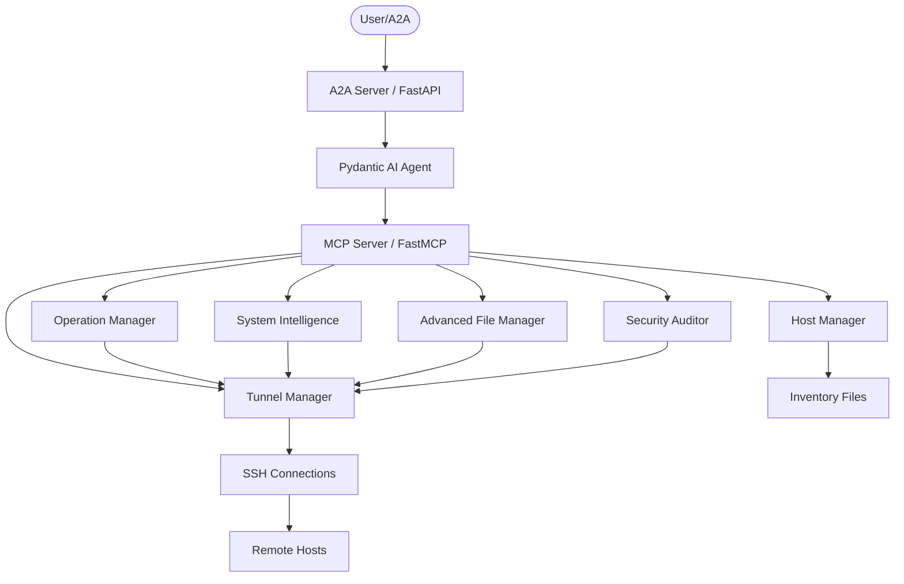
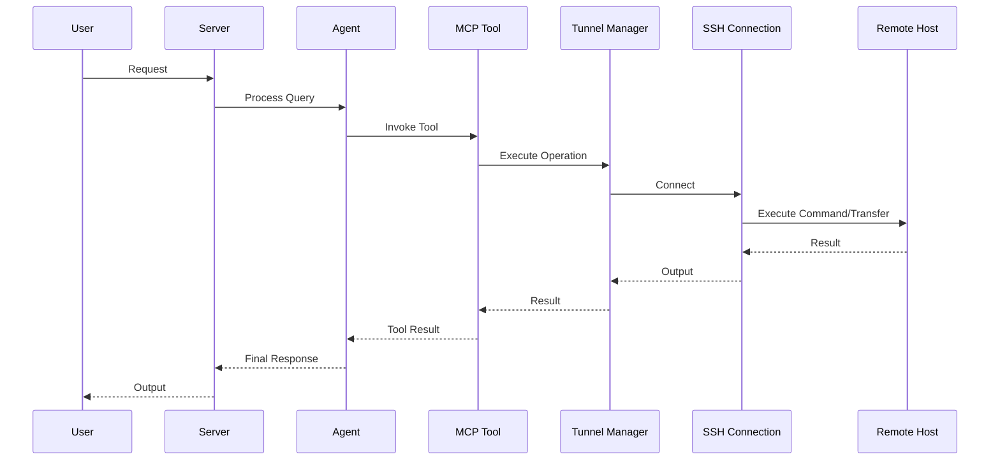

# AGENTS.md

> Claude Code loads this file via `CLAUDE.md` (`@AGENTS.md` import) — the two stay
> in sync. Edit **this** file, not `CLAUDE.md`.

## Tech Stack & Architecture
- Language/Version: Python 3.10+
- Core Libraries: `agent-utilities`, `fastmcp`, `paramiko`, `pydantic-ai`
- Key principles: Functional patterns, Pydantic for data validation, asynchronous tool execution.
- Architecture:
    - `mcp_server.py`: Main MCP server entry point and tool registration for SSH tunnel operations.
    - `agent_server.py`: Pydantic AI agent definition and logic for tunnel management.
    - `tunnel_manager.py`: Core SSH tunnel functionality including HostManager and Tunnel classes.
    - `operation_manager.py`: Enhanced operation tracking with streaming progress and cancellation.
    - `system_intelligence.py`: Remote system discovery and intelligence gathering.
    - `advanced_file_manager.py`: Advanced file operations including recursive ops, search, monitoring, and backup.
    - `security_auditor.py`: Security and compliance auditing capabilities.
    - `agent_data/`: Agent configuration, identity, and knowledge graph data.
    - `tests/`: Comprehensive test suite for tunnel management and MCP server functionality.

### Architecture Diagram


### Workflow Diagram


## Commands (run these exactly)
# Installation
pip install .[all]

# Quality & Linting (run from project root)
pre-commit run --all-files

# Testing (run from project root)
pytest --cov=tunnel_manager --cov-report=term-missing

# Execution Commands
# tunnel-manager
tunnel_manager.tunnel_manager:tunnel_manager
# tunnel-manager-mcp
tunnel_manager.mcp:mcp_server
# tunnel-manager-agent
tunnel_manager.agent:agent_server

## Project Structure Quick Reference
- MCP Entry Point → `mcp_server.py`
- Agent Entry Point → `agent_server.py`
- Core Library → `tunnel_manager/tunnel_manager.py`
- Agent Data → `tunnel_manager/agent_data/`
- Tests → `tests/`

## Enhanced Capabilities

### Operation Manager (`operation_manager.py`)
Provides enhanced operation tracking and management for long-running operations:
- **Streaming Progress**: Real-time progress updates with cancellation support
- **Resource Monitoring**: Track CPU, memory, and disk usage during operations
- **Session Management**: Persistent SSH connection pooling and reuse
- **Operation Cancellation**: Graceful cancellation of in-progress operations
- **MCP Tools**: start_operation, get_operation_progress, cancel_operation, get_resource_metrics, list_active_sessions

### System Intelligence (`system_intelligence.py`)
Remote system discovery and intelligence gathering:
- **System Info**: OS version, hardware specs, installed packages, uptime
- **Service Discovery**: Running services, processes, and open ports
- **Log Analysis**: Pattern matching and statistics for log files
- **Network Topology**: Interfaces, routes, DNS, and active connections
- **MCP Tools**: get_system_info, discover_services, analyze_logs, network_topology

### Advanced File Manager (`advanced_file_manager.py`)
Advanced file operations for remote hosts:
- **Recursive Operations**: Copy, move, delete, list, chmod, chown on directories
- **Content Search**: Grep-like search across multiple directories
- **File Monitoring**: Real-time file/directory change detection
- **File Comparison**: Compare files across different hosts
- **Smart Backup**: Automated backups with compression and versioning
- **MCP Tools**: recursive_file_operations, file_content_search, file_watch_monitor, file_diff_compare, smart_backup

### Security Auditor (`security_auditor.py`)
Security and compliance auditing capabilities:
- **Security Audit**: Comprehensive security assessment with scoring
- **Compliance Checks**: CIS Benchmark, PCI DSS, HIPAA standard validation
- **Vulnerability Scanning**: Package and configuration vulnerability detection
- **Access Control Audit**: User, permission, sudo, and SSH access auditing
- **MCP Tools**: security_audit, compliance_check, vulnerability_scan, access_control_audit

### File Tree
```text
├── .bumpversion.cfg
├── .codespellignore
├── .dockerignore
├── .env
├── .gitattributes
├── .github
│   └── workflows
│       └── pipeline.yml
├── .gitignore
├── .pre-commit-config.yaml
├── AGENTS.md
├── Dockerfile
├── IMPLEMENTATION_PLAN.md
├── LICENSE
├── MANIFEST.in
├── README.md
├── compose.yml
├── debug.Dockerfile
├── mcp.compose.yml
├── pyproject.toml
├── pytest.ini
├── requirements.txt
├── scripts
│   ├── validate_a2a_agent_server.py
│   └── validate_agent_server.py
├── starship.toml
├── uv.lock
├── tests
│   ├── downloaded_inventory.txt
│   ├── downloaded_test.txt
│   ├── test_agent_server.py
│   ├── test_advanced_file_manager.py
│   ├── test_mcp_server.py
│   ├── test_operation_manager.py
│   ├── test_placeholder.py
│   ├── test_security_auditor.py
│   ├── test_system_intelligence.py
│   ├── test_tunnel.py
│   └── test_tunnel_manager.py
└── tunnel_manager
    ├── __init__.py
    ├── __main__.py
    ├── agent
    │   ├── AGENTS.md
    │   ├── CRON.md
    │   ├── CRON_LOG.md
    │   ├── HEARTBEAT.md
    │   ├── IDENTITY.md
    │   ├── MEMORY.md
    │   ├── USER.md
    │   ├── mcp_config.json
    │   └── templates.py
    ├── agent_data
    │   ├── CRON.md
    │   ├── CRON_LOG.md
    │   ├── HEARTBEAT.md
    │   ├── IDENTITY.md
    │   ├── MEMORY.md
    │   ├── NODE_AGENTS.md
    │   ├── USER.md
    │   ├── mcp_config.json
    │   ├── main_agent.md
    │   ├── icon.png
    │   ├── knowledge_graph.db
    │   └── chats
    ├── agent_server.py
    ├── advanced_file_manager.py
    ├── mcp_server.py
    ├── operation_manager.py
    ├── security_auditor.py
    ├── system_intelligence.py
    └── tunnel_manager.py
```

## Code Style & Conventions
**Always:**
- Use `agent-utilities` for common patterns (e.g., `create_mcp_server`, `create_agent`).
- Use `paramiko` for SSH operations with proper error handling.
- Define input/output models using Pydantic.
- Include descriptive docstrings for all tools (they are used as tool descriptions for LLMs).
- Check for optional dependencies using `try/except ImportError`.
- Use `ResponseBuilder` for consistent error responses in MCP tools.

**Good example:**
```python
from agent_utilities import create_mcp_server
from fastmcp import FastMCP
from pydantic import Field

mcp = create_mcp_server("my-agent")

@mcp.tool()
async def my_tool(
    param: str = Field(description="Parameter description"),
    ctx: Context = Field(default="")
) -> dict:
    """Description for LLM."""
    return ResponseBuilder.build(
        status=200,
        message="Success",
        details={"param": param}
    )
```

## Dos and Don'ts
**Do:**
- Run `pre-commit` before pushing changes.
- Use existing patterns from `agent-utilities`.
- Keep tools focused and idempotent where possible.

**Don't:**
- Use `cd` commands in scripts; use absolute paths or relative to project root.
- Add new dependencies to `dependencies` in `pyproject.toml` without checking `optional-dependencies` first.
- Hardcode secrets; use environment variables or `.env` files.

## Safety & Boundaries
**Always do:**
- Run lint/test via `pre-commit`.
- Use `agent-utilities` base classes.

**Ask first:**
- Major refactors of `mcp_server.py` or `agent_server.py`.
- Deleting or renaming public tool functions.

**Never do:**
- Commit `.env` files or secrets.
- Modify `agent-utilities` or `universal-skills` files from within this package.

## When Stuck
- Propose a plan first before making large changes.
- Check `agent-utilities` documentation for existing helpers.


## Testing with Timeout

To run tests with a timeout to prevent hanging, use the `pytest-timeout` plugin. You can combine it with the `-k` flag to run specific tests:

```bash
uv run pytest --timeout=60 -k "test_name_pattern"
```

## ⛔ No Scratch or Temporary Files in Repository

**NEVER write any of the following to this repository:**
- Temporary test scripts (`test_*.py`, `debug_*.py` outside of `tests/`)
- Scratch scripts or experimental one-off files
- Log files (`.log`, `.txt` command output)
- Random text files with command output or debug dumps
- Any file that is NOT production source code, tests in `tests/`, or documentation

**Why:** These files expose private filesystem paths, credentials, and internal infrastructure details when pushed to GitHub publicly.

**Where to put scratch work instead:**
- Use `~/workspace/scratch/` for temporary scripts and experiments
- Use `~/workspace/reports/` for command output and reports
- Keep test scripts in the `tests/` directory following proper pytest conventions

## ⛔ Keep the Repository Root Pristine — No Scratch / Temp / Debug Files

**The repository ROOT must contain only canonical project files** (packaging,
config, docs, lockfiles). The only hidden directories allowed at root are
`.git/`, `.github/`, and `.specify/` (plus a local, git-ignored `.venv/`).

**NEVER write any of the following — anywhere in the repo, and ESPECIALLY at the root:**
- One-off / debug / migration scripts: `fix_*.py`, `migrate_*.py`, `refactor_*.py`,
  `replace_*.py`, `update_*.py`, `debug_*.py`, or `test_*.py` **at the root**
  (real tests live in `tests/` only).
- Databases / data dumps: `*.db`, `*.db-wal`, `*.sqlite*`, `*.corrupted`.
- Logs / command output: `*.log`, scratch `*.txt`, `*.orig`, `*.rej`, `*.bak`.
- Build artifacts: `*.tsbuildinfo`, compiled binaries, coverage files.
- AI agent scratch directories: `.agent/`, `.agents/`, `.agent_data/`, `.tmp/`,
  `.hypothesis/`, or any per-tool cache committed to git.
- Any file that is NOT production source, a test in `tests/`, documentation, or
  a recognized config/lockfile.

**Why:** scratch at the root leaks private paths/credentials, bloats the tree,
and erodes a pristine codebase.

**Where scratch goes instead:** `~/workspace/scratch/` (experiments),
`~/workspace/reports/` (command output); tests go in `tests/` (pytest).
Before finishing a task, run `git status` and confirm no stray root files were added.

## Quality Bar — Leave the Codebase Clean (REQUIRED)

After completing any code change, run the project's pre-commit suite and drive it
**fully green** before committing:

```bash
pre-commit run --all-files
```

Resolve **every** issue it reports — failures, lint errors, type errors, and
warnings — **including problems that pre-date your change and were not caused by
your edits**. The standing goal is a clean, working codebase with **no errors and
no warnings**. Do not silence checks (`# noqa`, `# type: ignore`, `SKIP=`,
`--no-verify`) to force green unless the exception is already documented in this
file as a known, unavoidable limitation. Only commit once `pre-commit run
--all-files` passes cleanly; if a check legitimately cannot pass, stop and explain
why rather than bypassing it.

## Working with Git Worktrees (multi-session)

Multiple agents/sessions work the `agent-packages/*` repos concurrently. **Do not
edit the canonical checkout** (`/home/apps/workspace/agent-packages/<repo>`) — a
background `repository-manager` sync can reset its working tree and discard
uncommitted edits. Take your own git worktree on your own branch instead:

```bash
# preferred — repository-manager MCP:
rm_worktree add <repo> <your-branch>      # -> /home/apps/worktrees/<repo>/<your-branch>

# raw-git fallback:
git -C agent-packages/<repo> checkout main
git -C agent-packages/<repo> worktree add /home/apps/worktrees/<repo>/<branch> -b <branch>
```

Work in the worktree, **commit often** (commits survive a working-tree reset),
then merge to main locally (`rm_worktree merge <repo> <branch>`, or `git merge
--no-ff`). Each session must use a **distinct branch** — git allows a branch in
only one worktree, which is what keeps concurrent sessions from colliding.
Worktrees live under `/home/apps/worktrees/` (outside the workspace scan, so the
sync leaves them alone). Push only when asked.
