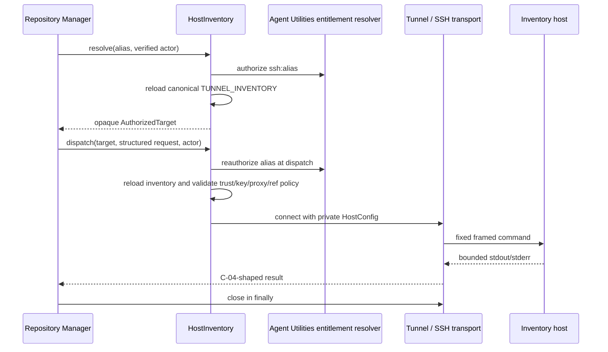

# Structured remote execution

RMDD-14 provides the reusable remote-worker boundary for Repository Manager. It
is intentionally narrower than the existing `tm_remote` MCP action: a caller
selects an authorized inventory alias and supplies a structured argv request.
Tunnel Manager remains the authority for inventory, SSH identity, known-host
trust, proxy policy, and secret references.

## Public contract

```python
from tunnel_manager import (
    HostInventory,
    RemoteCommandRequest,
    RemoteExecutionContext,
    TunnelCommandExecutor,
)

target = HostInventory().resolve("build-host", actor)
request = RemoteCommandRequest(
    argv=("pytest", "-q", "tests"),
    workdir="/srv/worktrees/project",
    timeout_seconds=900,
    max_stdout_bytes=64 * 1024,
    max_stderr_bytes=64 * 1024,
)
context = RemoteExecutionContext(
    command_id="rmcmd:workitem-command",
    worker_id="worker:remote-01",
    fence="fence:workitem-lease",
)
result = TunnelCommandExecutor().execute(
    target, request, actor, context=context
)
```

`context` is copied from the owning WorkItem lease. Tunnel Manager preserves all
three correlations exactly; it never creates a replacement command ID, worker ID,
or fence. The owning scheduler must conditionally publish the result with its
WorkItem CAS and discard stale-fence output.

`AuthorizedTarget` contains only `kind`, `alias`, and capability labels. It
never contains a hostname, username, identity path, proxy, known-host file,
password, or secret value. `RemoteCommandRequest` accepts `argv`, an absolute
remote `workdir`, opaque environment-reference names, and bounded timeout/output
limits. A raw shell string and caller-supplied connection fields are invalid.

The adapter renders one controller-owned command frame:

```text
cd -- <quoted-workdir> && exec <quoted-argv-elements>
```

Every caller value is one `shlex`-quoted argv element. A semicolon or pipeline
inside an argv element therefore remains data. Explicit `sh -c`/`bash -c`
requests are refused because they would turn the structured boundary back into a
caller-owned shell string.

## Authorization and dispatch



The inventory is loaded afresh on every resolution and dispatch. An inventory
edit or entitlement revocation between planning and execution therefore fails
closed or uses the newly authorized configuration; stale `HostConfig` objects
are never reused. The result has only opaque command/worker/fence identifiers,
bounded redacted output tails, frozen typed log/artifact-reference fields, stable
C-10 failure classes, and cleanup status. Free-form error-message fields are not
part of the frozen result contract.

Known-host, identity-file, proxy allowlist, and opaque secret-reference checks
run before a transport factory is called. Transport `close()` runs in `finally`,
including connect, timeout, authorization, and command failures.

The structured executor uses an additive `Tunnel.run_command(...,
propagate_errors=True)` flag so timeout and SSH policy failures retain their stable
failure classes. The flag defaults to `False`; existing Tunnel callers continue to
receive the legacy `CommandResult` error shape.

The request/result limits follow the frozen C-04 models: execution timeout is
bounded at 86,400 seconds and artifact references at 1 GiB. Tunnel Manager may
apply a stricter local output or transfer policy at dispatch; artifact production
and transfer remain RMDD-15 responsibilities.

## Dependency decision for Repository Manager

RMDD-14 does not add a Repository Manager dependency or modify a package extra.
The recommended initial integration is **MCP composition through the existing
multiplexer**:

| Option | Benefits | Costs / risk |
| --- | --- | --- |
| Optional direct `remote` library extra | Lowest call latency; direct typed Python seam; simple fake transport injection | Couples release/version lifecycles; requires a second package import path and compatibility matrix; makes it easier to bypass the tunnel-manager credential boundary |
| MCP composition (recommended first) | Tunnel Manager remains the sole inventory/credential authority; independently deployable; works across hosts and mixed package versions; existing multiplexer policy applies | One extra MCP hop and availability dependency; RMDD-15 must map the C-04 models to the tool payload |

Use the stable model shape and alias-only semantics in either mode. A future
operator-approved optional extra may call this library directly when measured
latency or worker placement justifies the coupling, but it must retain the same
contract fixtures, reauthorization behavior, and security gates. No dependency
decision is applied by this lane.

`environment_refs` are accepted only as opaque names and are refused by this
SSH adapter until an approved remote environment resolver exists; raw
environment values are never accepted.
