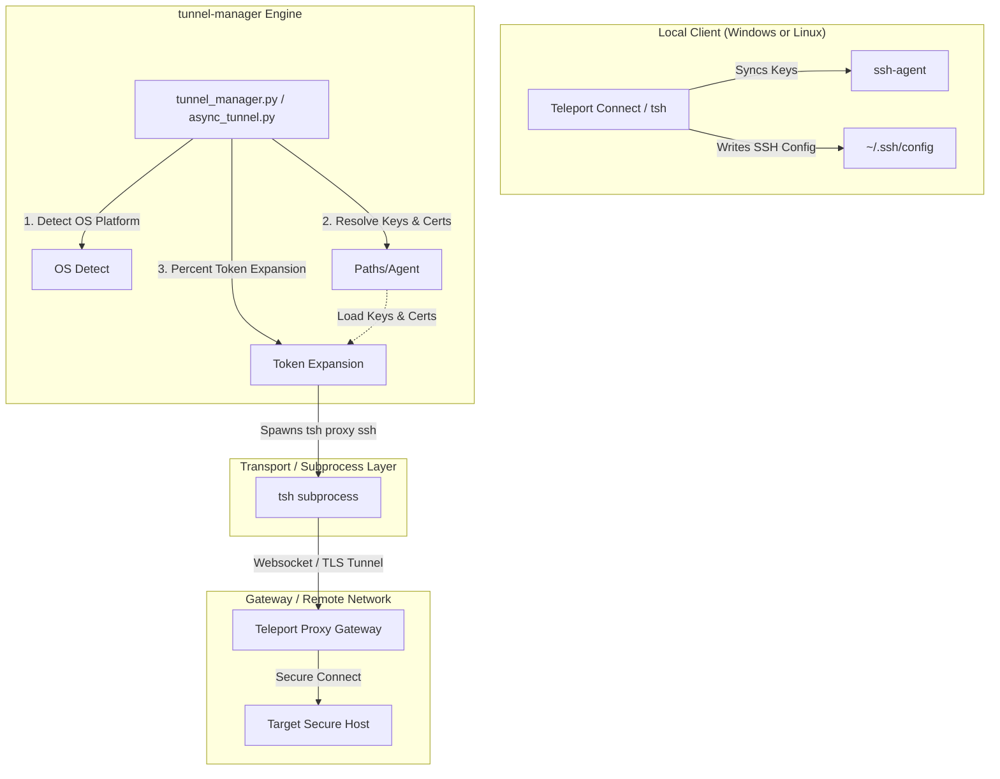
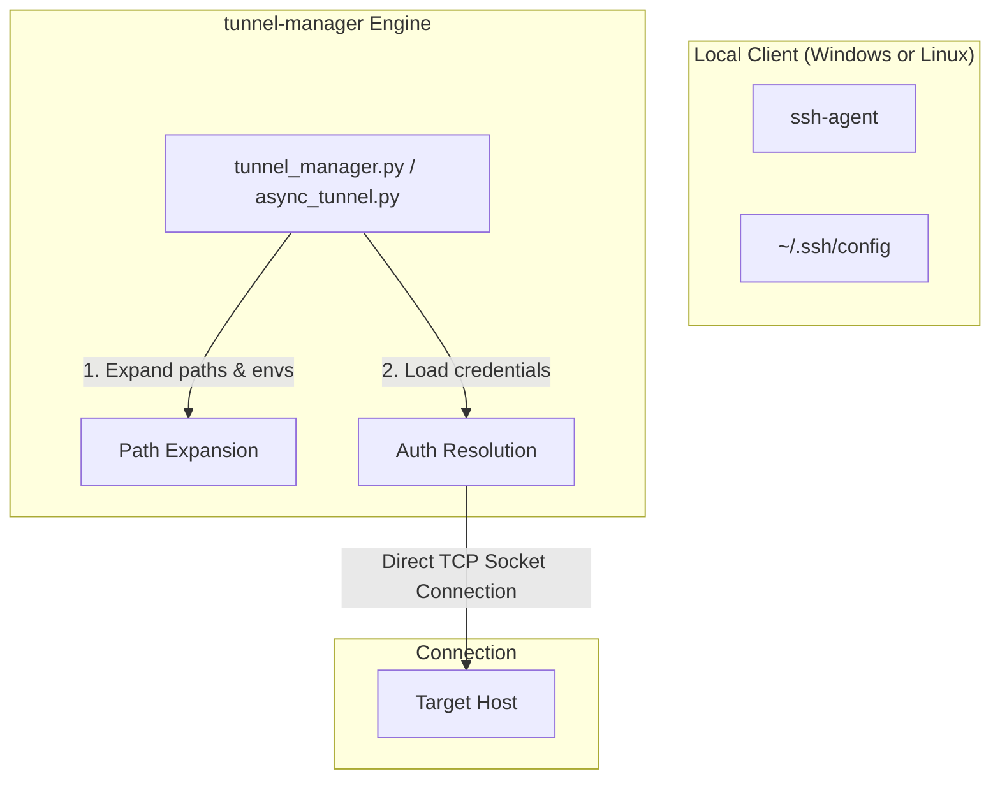

# Teleport & Cross-OS Tunnel Architecture

This document describes the unified connection architecture of the `tunnel-manager` project, explaining how it integrates with standard SSH services, Teleport/Teleport Connect, and operates natively across **Linux** and **Windows** host operating systems.

---

## 1. Connection Architectures

The connection layer is designed around standard OpenSSH specifications. It dynamically resolves configuration parameters, allowing seamless transition between custom security environments and standard TCP connections.

### Architecture A: Agentic Certificate & Proxy Tunneling (With `tsh` / Teleport Connect)

Designed for zero-trust environments where resources are protected by an access gateway (e.g. Teleport, HashiCorp Vault, or an enterprise SSH Bastion). Connections require short-lived, CA-signed OpenSSH certificates rather than static keys, and transport streams must be proxied.



#### Key Mechanics:
1.  **Identity & Certificate Load**: The engine reads the `IdentityFile` and `CertificateFile` parameters from the local SSH config (or parameters). The private key and the CA-signed user certificate are loaded into memory and paired.
2.  **SSH Agent Integration**: When `tsh login` or Teleport Connect is active, the short-lived credentials are cached in the system's local `ssh-agent`. `tunnel-manager` automatically queries the active agent to authenticate the connection, removing the need for manual path configurations.
3.  **Proxy Tunneling**: Direct TCP connections to port 22 are blocked. Instead, `tunnel-manager` invokes `tsh proxy ssh --cluster=<name> %r@%h:%p` as a subprocess. The proxy command acts as a local socket wrapper, tunneling the SSH payload safely over HTTP/TLS to the proxy gateway.

---

### Architecture B: Standard Native Direct Access (Without `tsh`)

Designed for traditional cloud infrastructure, secure VPC networks, or local/homelab environments that use standard static key pairs, SSH agent caching, or password authentication.



#### Key Mechanics:
1.  **Credential Lookup**: The engine checks the inventory or SSH config files, attempting to authenticate in the following order:
    -   Active local SSH agent keys.
    -   Specified private key files (`identity_file`).
    -   Plaintext password.
2.  **Direct Socket**: The engine opens a native TCP connection directly to the target host's IP/hostname on the specified port (default 22). No intermediate proxy sub-processes are created.

---

## 2. Platform Native Abstractions (Linux & Windows)

To ensure zero burden on the end-user, the codebase automatically detects the host operating system (`platform.system()`) and configures system-level features accordingly.

### Path Resolvers
-   **Linux**: Expands `~` using standard Unix home directory conventions (`/home/username`).
-   **Windows**: Expands `~` using Windows environment variables (`C:\Users\username`).
-   Paths are normalized using Python's `os.path.abspath(os.path.expanduser(path))` to format path separators correctly for the host OS (`/` on Linux vs `\` on Windows).

### Subprocess Shell Execution
When spawning proxy sub-processes (such as `tsh`):
-   **Executable Resolution**: Uses `shutil.which` to dynamically find the executable (searching for `tsh` on Linux and `tsh.exe` on Windows).
-   **Command Token Expansion**: Openssh-style tokens like `%h` (host), `%p` (port), and `%r` (user) are manually expanded before spawning to prevent shell-interpretation discrepancies.
-   **Platform Spawning**: Spawns command arrays without shell wrappers where possible to keep execution fast and prevent shell injection vulnerabilities on both platforms.

---

## 3. Configuration & Opt-in Mechanics

Teleport Connect integration is **opt-in and automated**. If standard SSH config rules match the target, or if a proxy command / certificate path is explicitly specified, the engine activates Architecture A. If not, it gracefully defaults to Architecture B.

### Example: Standard SSH Config (`~/.ssh/config`)
No modifications are required in `tunnel-manager` inventory files if your standard SSH configuration is already mapped:

```ssh
Host *.teleport.example.com
    User local-user
    IdentityFile ~/.tsh/keys/teleport.example.com/local-user
    CertificateFile ~/.tsh/keys/teleport.example.com/local-user-ssh/teleport.example.com-cert.pub
    ProxyCommand tsh proxy ssh --cluster=teleport.example.com %r@%h:%p
```

The system will automatically parse this config, expand the home directory paths (`~`), resolve the certificate/key relationship, expand `%r`, `%h`, `%p` placeholders, and establish the secure tunnel natively.
